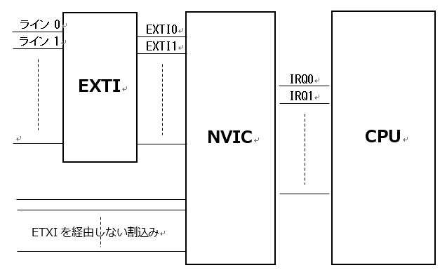

# μT-Kernel3.0 STM32H7マイコン向け実装仕様書 <!-- omit in toc -->
## Version.02.00.00 <!-- omit in toc -->
## 2023.12.01 <!-- omit in toc -->

<div class="page"/>

# 目次 <!-- omit in toc -->

- [1. 概要](#1-概要)
  - [1.1. 目的](#11-目的)
  - [1.2. 対象ハードウェア](#12-対象ハードウェア)
  - [1.3. ターゲット名](#13-ターゲット名)
  - [1.4. 関連ドキュメント](#14-関連ドキュメント)
  - [1.5. ソースコード構成](#15-ソースコード構成)
- [2. 基本実装仕様](#2-基本実装仕様)
  - [2.1. 対象マイコン](#21-対象マイコン)
    - [2.1.1. 実行モードと保護レベル](#211-実行モードと保護レベル)
    - [2.1.2. CPUレジスタ](#212-cpuレジスタ)
    - [2.1.3. 低消費電力モードと省電力機能](#213-低消費電力モードと省電力機能)
    - [2.1.4. コプロセッサ対応](#214-コプロセッサ対応)
  - [2.2. メモリ関連](#22-メモリ関連)
    - [2.2.1. メモリモデル](#221-メモリモデル)
    - [2.2.2. マイコンのアドレス・マップ](#222-マイコンのアドレスマップ)
    - [2.2.3. OSのメモリマップ](#223-osのメモリマップ)
    - [2.2.4. スタック](#224-スタック)
    - [2.2.5. 動的メモリ管理](#225-動的メモリ管理)
  - [2.3. 割込みおよび例外関係](#23-割込みおよび例外関係)
    - [2.3.1. マイコンの割込みおよび例外](#231-マイコンの割込みおよび例外)
    - [2.3.2. 割込み関連定義](#232-割込み関連定義)
    - [2.3.3. ベクタテーブル](#233-ベクタテーブル)
    - [2.3.4. 割込み優先度](#234-割込み優先度)
    - [2.3.5. OS内部で使用する割込み](#235-os内部で使用する割込み)
    - [2.3.6. 多重割込み対応](#236-多重割込み対応)
    - [2.3.7. クリティカルセクション](#237-クリティカルセクション)
    - [2.3.8. μT-Kenrel/OSの割込み管理機能](#238-μt-kenrelosの割込み管理機能)
    - [2.3.9. μT-Kernel/SMの割込み管理機能](#239-μt-kernelsmの割込み管理機能)
    - [2.3.10. OS管理外割込み](#2310-os管理外割込み)
    - [2.3.11. その他の例外処理](#2311-その他の例外処理)
- [3. システムの起動](#3-システムの起動)
  - [3.1. 起動処理](#31-起動処理)
    - [3.1.1. リセットハンドラ](#311-リセットハンドラ)
    - [3.1.2. OS初期化処理](#312-os初期化処理)
  - [3.2. 初期タスク](#32-初期タスク)
    - [3.2.1. 初期タスクの処理](#321-初期タスクの処理)
- [4. システムの終了と再起動](#4-システムの終了と再起動)
  - [4.1. 終了処理と再起動処理](#41-終了処理と再起動処理)
- [5. タスク](#5-タスク)
  - [5.1. タスク属性](#51-タスク属性)
  - [5.2. タスクの処理ルーチン](#52-タスクの処理ルーチン)
  - [5.3. タスク・コンテキスト情報](#53-タスクコンテキスト情報)
- [6. 時間管理機能](#6-時間管理機能)
  - [6.1. システムタイマ](#61-システムタイマ)
  - [6.2. タイムイベントハンドラ](#62-タイムイベントハンドラ)
- [7. その他の実装仕様](#7-その他の実装仕様)
  - [7.1. 物理タイマ機能](#71-物理タイマ機能)
    - [7.1.1. 使用するハードウェアタイマ](#711-使用するハードウェアタイマ)
    - [7.1.2. タイマの設定](#712-タイマの設定)
    - [7.1.3. タイマ割込み](#713-タイマ割込み)
  - [7.2. T-Monitor互換ライブラリ](#72-t-monitor互換ライブラリ)
    - [7.2.1. コンソール入出力](#721-コンソール入出力)
- [8. 変更履歴](#8-変更履歴)

<div class="page"/>

# 1. 概要
## 1.1. 目的
本書はSTM32H7向けのμT-Kernel3.0の実装仕様を記載した実装仕様書である。
対象は、TRONフォーラムから公開されているμT-Kernel 3.0(V3.00.07)のうち、STM32H7マイコン向けの実装部分である。
本実装ではSTM32H7マイコンを搭載した対象システム(実機)は定めず、よって対象システムに対する実装は含まれない。実際の本実装を使用する場合は、対象システムに関する実装を作成する必要がある。

ハードウェアに依存しない共通の実装仕様は「μT-Kernel3.0共通実装仕様書」を参照、ARMv7mコアに共通の仕様は「μT-Kernel3.0 ARMv7-M向け実装仕様書」を参照のこと。

以降、単にOSと称する場合はμT-Kenrel3.0を示し、本実装と称する場合、前述のソースコードの実装を示す。

## 1.2. 対象ハードウェア
本実装はマイコンのみであり、実機(マイコンボード)は含まれない。
実装対象のハードウェアは以下の通りである。

| 分類         | 名称        | 備考                         |
| ------------ | ----------- | ---------------------------- |
| 搭載マイコン | STM32H723ZG | STマイクロエレクトロニクス製 |

## 1.3. ターゲット名
本実装では対象ターゲットを定めないのでターゲット名も定めない。関連する識別名は以下とする。

| 分類                  | 名称            | 対象              |
| --------------------- | --------------- | ----------------- |
| 対象CPU               | CPU_STM32H723   | STM32H723         |
| 対象CPUアーキテクチャ | CPU_CORE_ARMV7M | ARMv7-M           |
| 対象CPUコア           | CPU_CORE_ACM7   | ARM Cortex-M7コア |

識別名は対象システムの以下のファイルで定義する。

     include/sys/sysdepend/<対象システム>/machine.h

## 1.4. 関連ドキュメント
OSの標準的な仕様は「μT-Kernel 3.0仕様書」に記載される。
ハードウェアに依存しない共通の実装仕様は、「μT-Kernel3.0共通実装仕様書」に記載される。
また、対象とするマイコンを含むハードウェアの仕様は、それぞれの仕様書などのドキュメントに記載される。

以下に関連するドキュメントを記す。

| 分類             | 名称                                                                    | 発行                       |
| ---------------- | ----------------------------------------------------------------------- | -------------------------- |
| OS               | μT-Kernel 3.0仕様書(Ver.3.00.01)<br>TEF020-S004-03.00.01                | TRONフォーラム             |
| OS               | μT-Kernel3.0共通実装仕様書(Ver.2.00.00)<br>TEF033-W002-2304xx           | TRONフォーラム             |
| T-Monitor        | T-Monitor仕様書<br>TEF020-S002-01.00.01                                 | トロンフォーラム           |
| デバイスドライバ | μT-Kernel 3.0 デバイスドライバ説明書(Ver.1.00.05)<br>TEF033-W007-221007 | トロンフォーラム           |
| 搭載マイコン     | STM32H723xxデータシート                                                 | STマイクロエレクトロニクス |

## 1.5. ソースコード構成
機種依存定義sysdependディレクトリ下の本実装のディレクトリ構成を以下に示す。名称に(*)の点いたディレクトリが本実装の対象である。

```
─ sysdepend         ハードウェア依存部
├       ：
├ <ターゲットn>          ターゲットn 依存部
└ cpu                    CPU依存部
   ├ stm32h7                       STM32H7マイコン依存部 (*)
   ├     ：
   └ <CPUn>                        CPUn依存部
   └ core                          コア依存部
          ├ armv7m                      ARMv7-Mコア依存部
          ├    ：
          └ <core n>                    コアn依存部
```

「ARMv7-Mコア依存部」は、ARMv7-Mコアに共通するコードであり、他の共通のコアを有するマイコンでも使用される。
「STM32H7マイコン依存部」は、前述のコア依存部以外の本マイコンに固有のコードである。

<div class="page"/>

# 2. 基本実装仕様
## 2.1. 対象マイコン
実装対象のマイコンの基本的な仕様を以下に記す。

| 項目    | 内容                                                                                                           |
| ------- | -------------------------------------------------------------------------------------------------------------- |
| CPUコア | ARM Cortex-M7                                                                                                  |
| ROM     | 1MB(内蔵フラッシュROM)                                                                                         |
| RAM     | SRAM(D1ドメイン) 320KB, SRAM(D2ドメイン) 32KB, SRAM(D3ドメイン) 16KB<br> ITCM RAM 64KB<br>DTCM RAM128KB |
※本実装ではOSはSRAM(D1ドメイン)のみを使用する。

### 2.1.1. 実行モードと保護レベル
ARMv7-M実装仕様書を参照のこと。

### 2.1.2. CPUレジスタ
ARMv7-M実装仕様書を参照のこと。

### 2.1.3. 低消費電力モードと省電力機能
省電力機能はサポートしていない。プロファイルTK_SUPPORT_LOWPOWERはFALSEである。よって、マイコンの低消費電力モードに対応する機能は持たない。

省電力機能のAPI（low_pow、off_pow）をサポートする場合は、対象システムの以下のファイルに、適切な省電力処理を記述し、プロファイルTK_SUPPORT_LOWPOWERをTRUEに指定する。

/kernel/sysdepend/<対象システム>/power.c

### 2.1.4. コプロセッサ対応
本マイコンはIEEE754規格に準拠したFPU(浮動小数点ユニット)を内蔵する。
詳細はARMv7-M実装仕様書を参照のこと。

## 2.2. メモリ関連
### 2.2.1. メモリモデル
ARMv7-M実装仕様書を参照のこと。

### 2.2.2. マイコンのアドレス・マップ
マイコンのアドレス・マップは、基本的にデフォルト・アドレス・マップに従う。
以下に各マイコンのアドレス・マップを記す。表の備考欄のCode、SRAM、Peripheralの各領域はデフォルト・アドレス・マップの対応する領域を示す（詳細はマイコンの仕様書を参照のこと）。

| アドレス<br>（上段：開始<br>下段：終了） | 種別              | サイズ<br>(KByte) | 備考                                |
| ---------------------------------------- | ----------------- | ----------------- | ----------------------------------- |
| 0x0000 0000<br>0x0000 FFFF               | ITCM              | 64                | Code領域 ※1                         |
| 0x0800 0000<br>0x080F FFFF               | 内蔵ROM           | 1024              | Code領域<br>内蔵フラッシュROM       |
| 0x2000 0000<br>0x2001 FFFF               | DTCM              | 128               | SRAM領域 ※1                         |
| 0x2400 0000<br>0x2404 FFFF               | SRAM1             | 320               | SRAM領域<br>                        | 内蔵SRAM(D1ドメイン) |
| 0x3000 0000<br>0x3000 7FFF               | SRAM2             | 32                | SRAM領域 ※1<br>内蔵SRAM(D2ドメイン) |
| 0x3800 0000<br>0x3800 3FFF               | SRAM3             | 16                | SRAM領域 ※1<br>                     | 内蔵SRAM(D3ドメイン) |
| 0x4000 0000<br>0x5FFF FFFF               | Peripheral        |                   | Peripheral領域                      |
| 0xE000 0000<br>0xFFFF FFFF               | CPU内レジスタ領域 |                   |                                     |

※１ 本領域は本実装ではOSは使用しない。ユーザプログラムから使用可能である。

### 2.2.3. OSのメモリマップ
本実装では、マイコンの内蔵ROMおよびSRAMを使用する。
OSを含む全てのプログラムのコードは内蔵ROMに配置され、実行される。
例外ベクタテーブルは、リセット時は内蔵ROM上にあるが、OSの初期化処理にてSRAM上に転送される。ただし、コンフィグレーションUSE_STATIC_IVTを有効にすることにより、SRAM上への再配置を禁止することができる（初期値は無効）。再配置を禁止した場合、APIによる割込みハンドラの登録が不可となる。

以下に内蔵ROMおよびSRAM1のメモリマップを示す。表中でアドレスに「-」が記載された箇所はデータのサイズによりＣ言語の処理系にてアドレスが決定され、OS内ではアドレスの指定は行っていない。

(1) 内蔵ROMのメモリマップ
| アドレス<br>（上段：開始<br>下段：終了） | 種別               | 内容                                               |
| ---------------------------------------- | ------------------ | -------------------------------------------------- |
| 0x0800 0000<br>-                         | 例外ベクタテーブル | 例外や割込みのベクタテーブル<br>リセット時のみ有効 |
| -<br>-                                   | プログラムコード   | プログラムコードが配置される領域                   |
| -<br>-                                   | 定数データ         | C言語の定数データなどが配置される領域              |

|(2) メインRAMのメモリマップ
| アドレス<br>（上段：開始<br>下段：終了） | 種別               | 内容                                               |
| ---------------------------------------- | ------------------ | -------------------------------------------------- |
| SRAM先頭アドレス<br>-                    | 例外ベクタテーブル | 例外や割込みのベクタテーブル<br>OSの初期化後に有効 |
| -<br>-                                   | プログラムデータ   | C言語の変数等が配置される領域                      |
| -<br>-                                   | OS管理領域         | OS内部の動的メモリ管理の領域                       |
| -<br>SRAM終端アドレス                    | 例外スタック領域   | 初期化スタックとして、初期化処理時のみに使用       |

### 2.2.4. スタック
ARMv7-M向け実装仕様書を参照のこと。

### 2.2.5. 動的メモリ管理
ARMv7-M向け実装仕様書を参照のこと。

## 2.3. 割込みおよび例外関係
### 2.3.1. マイコンの割込みおよび例外
ARMv7-M向け実装仕様書を参照のこと。

### 2.3.2. 割込み関連定義
本マイコンのハードウェアに関わる割込み関連の定義を以下に記す。項目はARMv7-Mにおいて共通である。ARMv7-M向け実装仕様書を参照のこと。

| 名称                  | 値  | 意味                       |
| --------------------- | --- | -------------------------- |
| N_INTVEC              | 190 | 外部割込み数               |
| N_SYSVEC              | 16  | 例外数                     |
| INTPRI_BITWIDTH       | 4   | 割込み優先度の幅(ビット数) |
| INTPRI_MAX_EXTINT_PRI | 1   | 外部割込みの最高優先度     |
| INTPRI_SVC            | 0   | SVC例外の優先度            |
| INTPRI_SYSTICK        | 1   | システムタイマ例外の優先度 |
| INTPRI_PENDSV         | 15  | PendSV例外の優先度         |

以上の定義は以下のファイルで記述される。

     /include/sys/sysdepend/cpu/stm32h7/sysdef.h

### 2.3.3. ベクタテーブル
本マイコンでは各種例外に対応する例外ハンドラのアドレスを設定したベクタテーブルを有する。
本実装では、リセット時のベクタテーブルは、以下のファイルにvector_tblとして定義される。

        kernel/sysdepend/cpu/stm32h7/vector_tbl.c

OSの初期化処理において、上記のROM上のベクタテーブルはRAM上にコピーされ、以降そちらが使用される。このRAM上のベクターテーブルはARMv7-Mにおいて共通である。ARMv7-M向け実装仕様書を参照のこと。
ただし、コンフィグレーションUSE_STATIC_IVTが1に設定されている場合は、ROM上のベクターテーブルが使用され続ける。USE_STATIC_IVTの初期値は0である。

### 2.3.4. 割込み優先度
ARMv7-Mに共通する事項はARMv7-M向け実装仕様書を参照のこと。
本マイコンは、割込み優先度を4bit(0～15)の16段階に設定できる（優先度の数字の小さい方が優先度は高い）。
外部割込みは優先度0～15が割り当て可能である。ただし、優先度0はOSからマスク不可のため、使用は許されない。また、優先度1と15はOS内の割込み処理で使用しているため、同様に使用は許されない。よって、実際に割当て可能な外部割込みの優先度は、2～14の13段階である。

次の例外は、優先度0より高い優先度に固定されている。
- リセット（優先度 -3）
- NMI(優先度 -2)
- ハードフォルト(優先度 -1)

### 2.3.5. OS内部で使用する割込み
OSの内部で使用する割込みには、以下のようにマイコンの割込みまたは例外が割り当てられる。該当する割込みまたは例外は、OS以外で使用してはならない。詳細はARMv7-M向け実装仕様書を参照のこと。


| 種類                 | 割込み番号 | 割り当てられる割込み・例外 | 優先度 |
| -------------------- | ---------- | -------------------------- | ------ |
| システムタイマ割込み | 15         | SysTick                    | 1      |
| ディスパッチ要求     | 14         | PendSV                     | 15     |
| 強制ディスパッチ要求 | 14         | PendSV                     | 15     |

各割込みの優先度は以下のファイルで定義される。

	/include/sys/sysdepend/cpu/stm32h7/sysdef.h
```
#define INTPRI_SYSTICK        1    // システムタイマ割込み
#define INTPRI_PENDSV         15   // PendSV
```

### 2.3.6. 多重割込み対応
ARMv7-M向け実装仕様書を参照のこと。

### 2.3.7. クリティカルセクション
最高外部割込み優先度は以下のファイルで定義される。詳細はARMv7-M向け実装仕様書を参照のこと。

	/include/sys/sysdepend/cpu/stm32h7/sysdef.h
```
#define INTPRI_MAX_EXTINT_PRI 1    // 最高外部割込み優先度
```

### 2.3.8. μT-Kenrel/OSの割込み管理機能
ARMv7-M向け実装仕様書を参照のこと。。

### 2.3.9. μT-Kernel/SMの割込み管理機能
μT-Kernel/SMの割込み管理機能は、CPUの割込み管理機能および割込みコントローラ(NVIC、EXTI)の制御を行う。
本機能の各APIの実装について以下に記す。

- CPU割込み制御
ARMv7-M向け実装仕様書を参照のこと。

- 割込みコントローラの制御
STM32H7マイコンには、割込みコントローラとしてNVICとEXTI(拡張割込み/イベントコントローラ)が内蔵されている。NVICはARM Cortex-Mに標準の割込みコントローラである。EXTIはSTM32独自の割込みコントローラであり、NVICにカスケード接続される。
NVIC、EXTI、CPUの関係の概略を以下の図に示す（詳細はマイコンのマニュアルを参照のこと）。



EXTIは入力として92本の割込み/イベントライン(ライン0～91)があり、各ラインについて割込みのマスク、トリガ条件が設定可能である（トリガ条件設定の可否はラインによる）。
EXTIからの出力はNVICに対応する割込みとして入力される。NVICにはEXTI経由以外の割込みも入力されている。NVICは各入力について割込みのマスク、優先度が設定可能である。

EXTIを経由する割込みを有効にするには、EXTIおよびNVICの両方で割込みのマスクを解除しなくてはならない。

μT-Kernel/SMの割込み管理機能は、NVICとEXTIの両割込みコントローラの制御に対応する。そこで、EXTIを制御するためにEXTIの各ラインに割込み番号の200以降を割り当てる。たとえば、EXTIのライン0が割込み番号200、ライン1が割込み番号201となる。
割込み番号200以降はμT-Kernel/SMの割込み管理機能でのみ使用可能である。この番号に割込みハンドラを定義することはできない（割込みハンドラを定義したい場合は、最終的に割り付けられたIRQ割込みにハンドラを定義する）。

各APIの実装を以降に記す。

① 割込みコントローラの割込み許可(EnableInt)
IRQ割込み（割込み番号0～190）の場合、NVICの割込みイネーブルセットレジスタ(ISER)を設定し、指定された割込みを許可する。同時に割込み優先度レジスタ(IPR)に指定された割込み優先度を設定する。
EXTIソース（割込み番号200～291）の場合、EXTIの割込みマスクレジスタ(EXTI_IMR)を設定し、指定された割込みを許可する。EXTIは割込み優先度の設定はできないので、指定した優先度は無視される。

② 割込みコントローラの割込み禁止(DisableInt)
IRQ割込み（割込み番号0～190）の場合、NVICの割込みイネーブルクリアレジスタ(ICER)を設定し、指定された割込みを禁止する。
EXTIソース（割込み番号200～291）の場合、EXTIの割込みマスクレジスタ(EXTI_IMR)を設定し、指定された割込みを禁止する。

③ 割込み発生のクリア(ClearInt)
IRQ割込み（割込み番号0～190）の場合、NVICの割込み保留クリアレジスタ(ICPR)を設定し、指定された割込みが保留されていればクリアする。
EXTIソース（割込み番号200～291）の場合、EXTIのペンディングレジスタ(EXTI_PR)を設定し、指定された割込みが保留されていればクリアする。

④ 割込みコントローラのEOI発行(EndOfInt)
本マイコンではEOIの発行は不要である。よって、EOI発行(EndOfInt)は何も実行しないマクロとして定義される。

⑤ 割込み発生の検査(CheckInt)
IRQ割込み（割込み番号0～190）の場合、割込みコントローラ(NVIC)の割込み保留クリアレジスタ(ICPR)を参照し、割込みの発生を調べる。
EXTIソース（割込み番号200～291）の場合、EXTIのペンディングレジスタ(EXTI_PR) を参照し、割込みの発生を調べる。

⑥ 割込みモード設定(SetIntMode)
割込みモードは、立ち上りエッジ(IM_HI)、立ち下りエッジ(IM_LOW)、または立ち上り立下り両エッジ(IM_BOTH)が指定可能である。
指定された割込みモードに応じて、EXTIの立ち上がりトリガ選択レジスタ(EXTI_RTSR)と立ち下りトリガ選択レジスタ(EXTI_FTSR)を設定する。
指定可能な割込みは、EXTIソース（割込み番号200～291）のみである。IRQ割込み（割込み番号0～190）を指定した場合は何も実行しない。
指定可能な割込みモードは以下のように定義される。ただし、割込みの種別により指定可能なモードが定められているので、マイコンのマニュアルを参照のこと。

```
#define IM_EDGE         0x0000          /* Edge trigger */
#define IM_HI           0x0002          /* Interrupt at rising edge */
#define IM_LOW          0x0001          /* Interrupt at falling edge */
#define IM_BOTH         0x0003          /* Interrupt at both edge */
```

なお、IM_EDGEは互換性のために定義している。たとえば、立ち上りエッジを指定する場合に、IM_EDGE | IM_HI のように記述することができる。

⑦ 割込みコントローラの割込みマスクレベル設定(SetCtrlIntLevel)
割込みコントローラに本機能はないため、未実装である。

⑧ 割込みコントローラの割込みマスクレベル取得(GetCtrlIntLevel)
割込みコントローラに本機能はないため、未実装である。

上記のAPIは以下のファイルに記述される。

     lib/libtk/sysdepend/cpu/stm32h7/int_stm32h7.c

### 2.3.10. OS管理外割込み
ARMv7-M向け実装仕様書を参照のこと。

### 2.3.11. その他の例外処理
ARMv7-M向け実装仕様書を参照のこと。

<div class="page"/>

# 3. システムの起動
## 3.1. 起動処理
### 3.1.1. リセットハンドラ
リセットハンドラはARMv7-M向け実装仕様書を参照のこと。
リセットハンドラから呼ばれるknl_startup_hw関数により対象システムに固有の処理が実行される。
knl_startup_hw関数は対象とするハードウェアおよびアプリケーションに応じて実装しなければならない。関数の仕様については、共通実装仕様書を参照のこと。
knl_startup_hw関数は対象システムの以下のファイルに定義される。本実装では未実装である。

     kernel/sysdepend/<対象システム>/hw_setting.c

### 3.1.2. OS初期化処理
OS初期化処理は共通部のmain関数で実行される。
main関数から以下の対象システムに依存する処理が実行される。

(1) デバイスの初期化 knl_init_device
main関数より呼び出され、デバイスドライバの登録に先立ち、必要なハードウェアの初期化を行う。
knl_init_device関数は対象とするハードウェアおよびアプリケーションに応じて実装しなければならない。
knl_init_device関数は対象システムの以下のファイルに定義される。本実装では未実装である。

     kernel/sysdepend/<対象システム>/devinit.c

## 3.2. 初期タスク
### 3.2.1. 初期タスクの処理
初期タスクの処理は共通部のinit_task_main関数で実行される。
init_task_main関数からハードウェア依存部の処理が呼び出される。

(1) デバイスの実行（knl_start_device）
デバイスドライバの登録、実行を行う。
knl_start_device関数は対象とするハードウェアおよびアプリケーションに応じて実装しなければならない。
knl_start_device関数は対象システムの以下のファイルに定義される。本実装では未実装である。

     kernel/sysdepend/<対象システム>/devinit.c

<div class="page"/>

# 4. システムの終了と再起動
## 4.1. 終了処理と再起動処理
終了処理と再起動処理は共通部のshutdown_system関数で実行される。shutdown_system関数からハードウェアに依存する処理が呼び出される。
対象ハードウェアに依存する処理のうち、本マイコンに依存する処理を記す。ARMv7-Mコアに共通の処理はARMv7-M向け実装仕様書を参照のこと。

(1) デバイスの終了処理 knl_finish_device
knl_start_deviceと対となるデバイスの終了処理を実行する。
knl_finish_device関数は対象システムの以下のファイルに定義される。本実装では未実装である。

     kernel/sysdepend/<対象システム>/devinit.c

(2) ハードウェア停止処理（knl_shutdown_hw）
ハードウェアをすべて停止し、マイコンを終了状態とする。本関数の処理でシステムは終了する。
knl_shutdown_hw関数は対象システムの以下のファイルに定義される。本実装では未実装である。

     kernel/sysdepend/<対象システム>/hw_setting.c

(2) ハードウェア再起動（knl_restart_hw）
ハードウェアの再起動処理を行う。knl_restart_hw関数は対象システムの以下のファイルに定義される。本実装では未実装である。

     kernel/sysdepend/<対象システム>/hw_setting.c

<div class="page"/>

# 5. タスク
本マイコンに依存するタスクの仕様を以下に記す。ARMv7-M向け実装仕様書も参照のこと。

## 5.1. タスク属性
タスク属性のハードウェア依存仕様を以下に示す。

| 属性    | 可否 | 説明               |
| ------- | ---- | ------------------ |
| TA_COP0 | 〇   | FPU(TA_FPUと同じ)  |
| TA_COP1 | ×    | 対応無し           |
| TA_COP2 | ×    | 対応無し           |
| TA_COP3 | ×    | 対応無し           |
| TA_FPU  | 〇   | FPU(TA_COP0と同じ) |

## 5.2. タスクの処理ルーチン
ARMv7-M向け実装仕様書を参照のこと。

## 5.3. タスク・コンテキスト情報
ARMv7-M向け実装仕様書を参照のこと。

<div class="page"/>

# 6. 時間管理機能
## 6.1. システムタイマ
ARMv7-M向け実装仕様書を参照のこと。

## 6.2. タイムイベントハンドラ
タイムイベントハンドラの実行中の割込みマスクレベルは、タイムイベントハンドラ割込みレベルTIMER_INTLEVELに設定される。TIMER_INTLEVELは、以下のファイルで定義される。

     include/sys/sysdepend/cpu/stm32h7/sysdef.h

本実装では初期値は以下のように0（すべての割込みを許可）が設定されている。

     #define TIMER_INTLEVEL   0    //すべての割込みを許可

<div class="page"/>

# 7. その他の実装仕様
## 7.1. 物理タイマ機能
### 7.1.1. 使用するハードウェアタイマ
マイコン内蔵の汎用タイマ（TIM2～TIM5）を使用して4個の物理タイマが実装されている。TIM2およびTIM5は32ビットタイマ、TIM3およびTIM4は16ビットタイマである。
汎用タイマには以下のように物理タイマ番号が1から割り当てられる。

| 物理タイマ番号 | 対応するタイマ | ビット幅 |
| -------------- | -------------- | -------- |
| 1              | TIM2           | 32       |
| 2              | TIM3           | 16       |
| 3              | TIM4           | 16       |
| 4              | TIM5           | 32       |

汎用タイマは物理タイマ以外の用途にも使用可能である。その場合は物理タイマAPIを呼び出さなければよい（API StartPhysicalTimerにて汎用タイマは物理タイマに初期化される）。

### 7.1.2. タイマの設定
物理タイマのクロック設定は、以下のファイルで定義される。

     include/sys/sysdepend/cpu/stm32h7/sysdef.h
```
#define TIM2PSC_PSC_INIT	0
#define TIM3PSC_PSC_INIT	0
#define TIM4PSC_PSC_INIT	0
#define TIM5PSC_PSC_INIT	0
```

この値は、汎用タイマのTIMx_PSCレジスタにプリスケーラ値として設定される。上記の設定を変更することにより、各物理タイマのクロックを変更できる。
本実装の初期値では、物理タイマのクロックはタイマクロックを未分周で使用する。タイマクロックの周波数はPCLK1と同じである。

### 7.1.3. タイマ割込み
物理タイマはその内部処理において、各タイマの割込みを使用する。


| 物理タイマ番号 | 対応する割込み       | 割込み番号 |
| -------------- | -------------------- | ---------- |
| 1              | TIM2グローバル割込み | 28         |
| 2              | TIM3グローバル割込み | 29         |
| 3              | TIM4グローバル割込み | 30         |
| 4              | TIM5グローバル割込み | 50         |

各割込みの優先度はに以下のファイルに定義される。割込み優先度は必要に応じて変更可能である。

     include/sys/sysdepend/cpu/stm32h7/sysdef.h
```
#define INTPRI_TIM2 5    // 物理タイマ1
#define INTPRI_TIM3 5    // 物理タイマ2
#define INTPRI_TIM4 5    // 物理タイマ3
#define INTPRI_TIM5 5    // 物理タイマ4
```

## 7.2. T-Monitor互換ライブラリ
### 7.2.1. コンソール入出力
T-Monitor互換ライブラリのAPIによるコンソール入出力の仕様を以下に示す。

| 項目       | 内容                            |
| ---------- | ------------------------------- |
| デバイス   | 内蔵UART (USART3)               |
| ボーレート | 115200bps                       |
| データ形式 | data 8bit, stop 1bit, no parity |

<div class="page"/>

# 8. 変更履歴
| 版数    | 日付       | 内容                                                                                                                                  |
| ------- | ---------- | ------------------------------------------------------------------------------------------------------------------------------------- |
| 2.00.00 | 2023.12.01 | ・内容および構成の全面見直し                                                                                                          |
| 1.00.02 | 2022.10.14 | ・誤字修正                                                                                                                            |
| 1.00.01 | 2022.10.07 | ・μT-Kernelおよび関連仕様書バージョン更新<br>・5.1リセット処理 (2)ベクタテーブルの移動<br>誤記修正 (誤) USE_NOINIT (正)USE_STATIC_IVT |
| 1.00.00 | 2022.06.30 | ・初版                                                                                                                                |

以上
1


